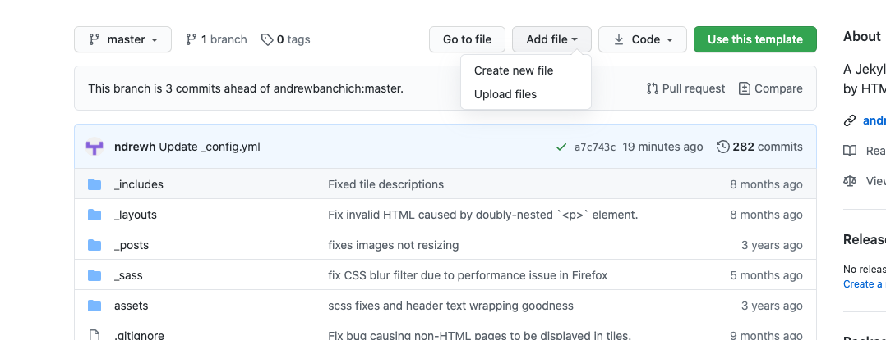
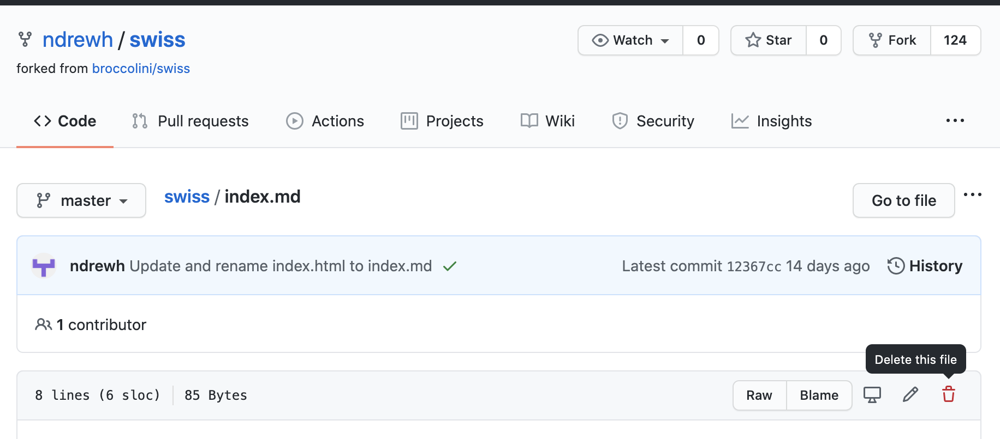
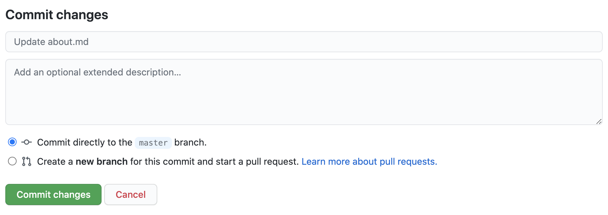
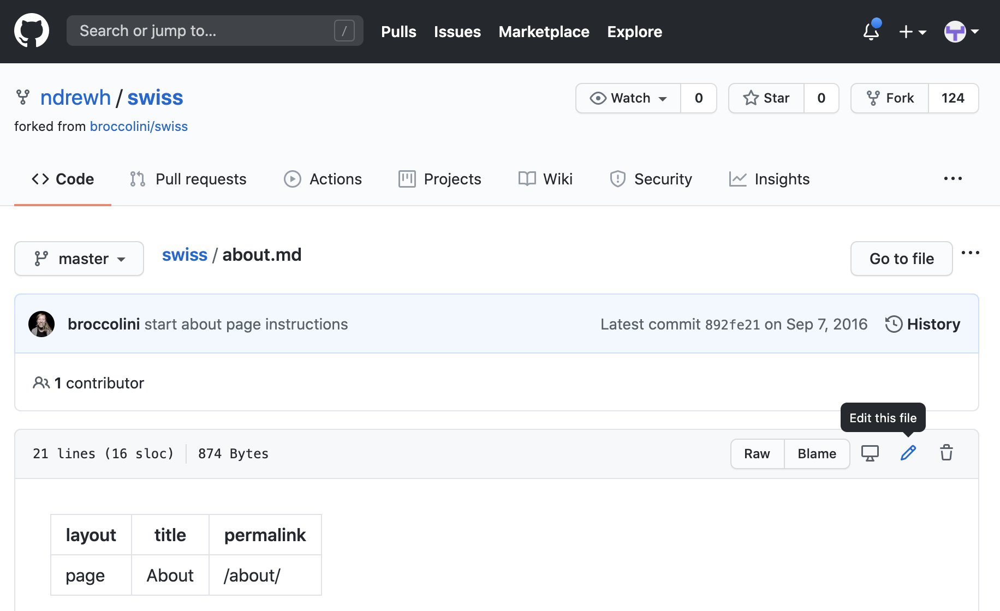
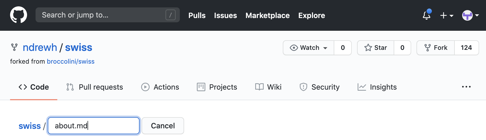
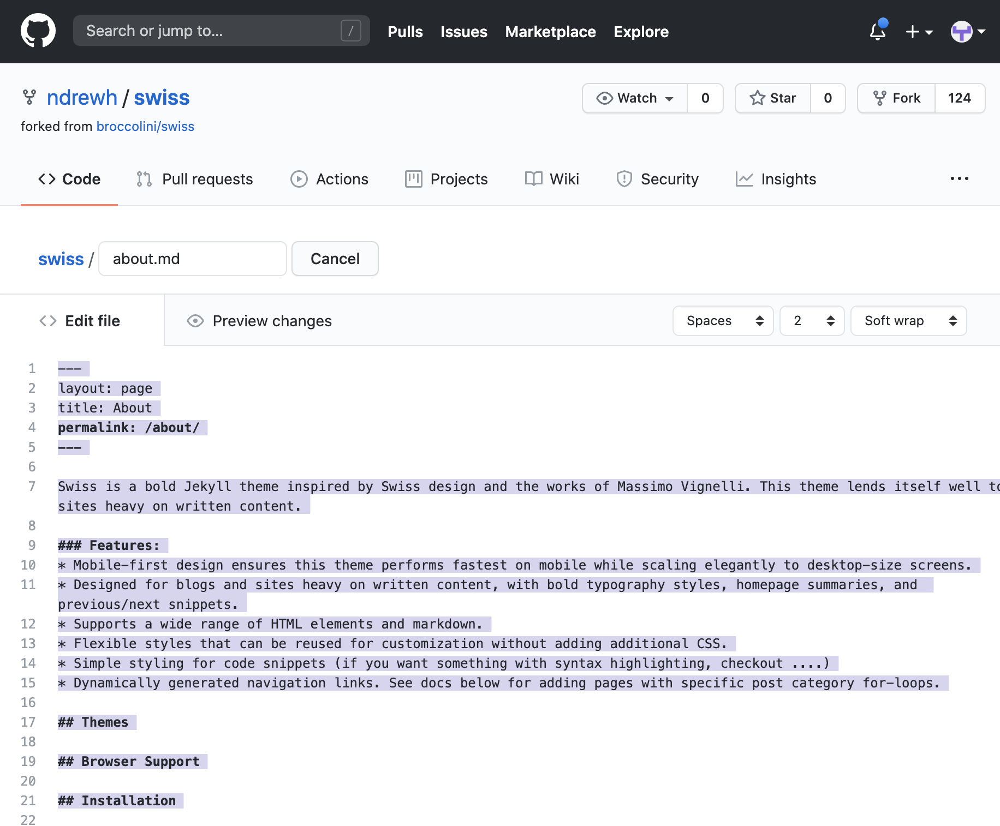

# Resume Workshop - Github Basics

- [Adding Files](#adding-files)
- [Removing Files](#removing-files)
- [Renaming Files](#renaming-files)
- [Duplicating Files](#duplicating-files)

## Adding Files

1. Click “Add File

2. Click ‘Create new file’

3. Name the file ‘projects.md’ or whatever you want the file to be named

4. Type whatever you want in the box

5. Click Commit new file

## Removing Files

1. Open the file you’d like to duplicate, click the trash can to delete

2. Click 'Commit changes'

## Renaming Files

1. Open the file you’d like to duplicate, click edit

2. Change the name

3. Scroll to the bottom of the page and click 'Commit changes'

## Duplicating Files

1. Open the file you’d like to duplicate, click edit

2. Copy the entire file contents (CTRL-C or CMD-C)

2. Go back to your repository home (click the repository name)

3. Click “Add File

4. Click ‘Create new file’

5. Name the file ‘projects.md’ or whatever you want the file to be named

6. Paste the contents of the file in the file body box

7. Click Commit new file
