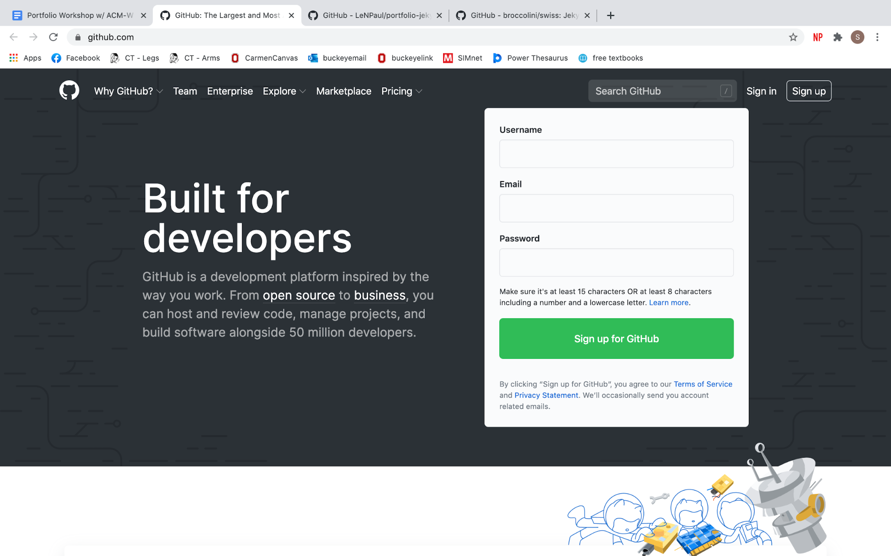
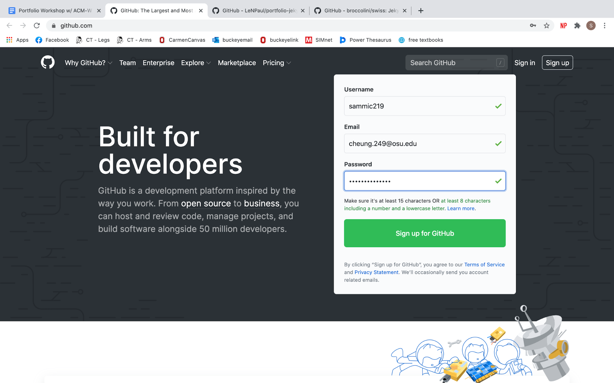
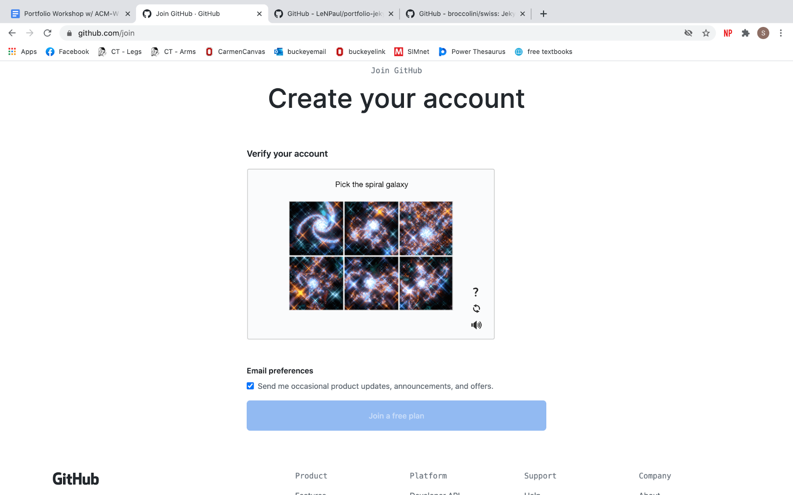
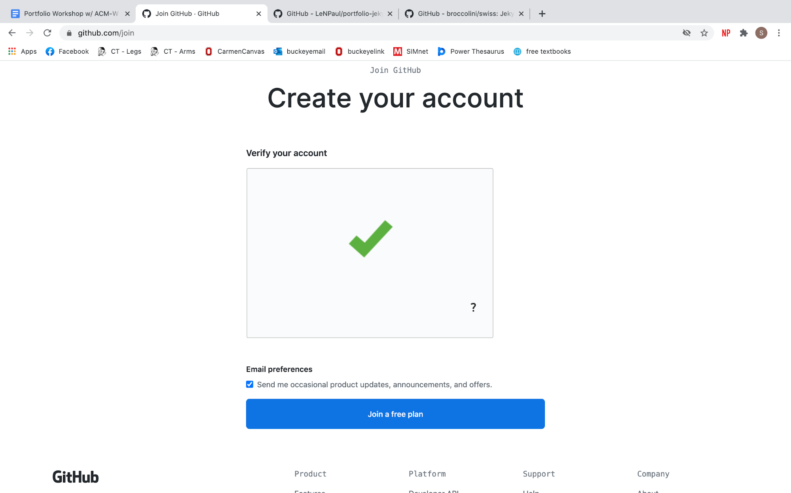
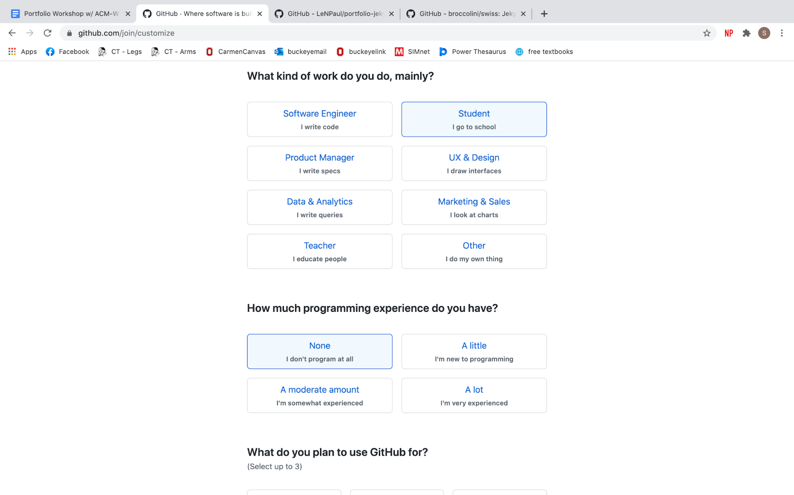
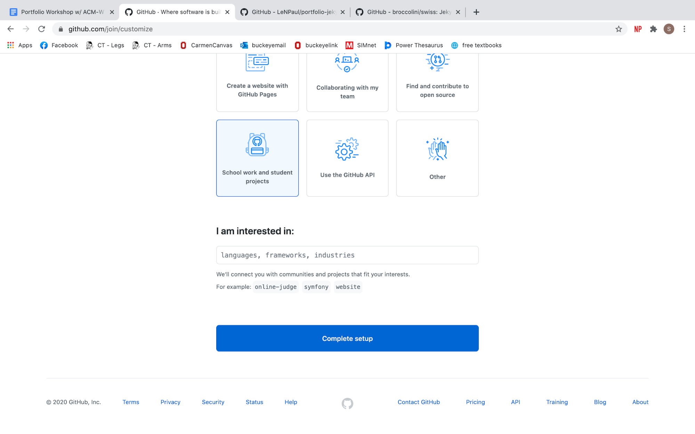
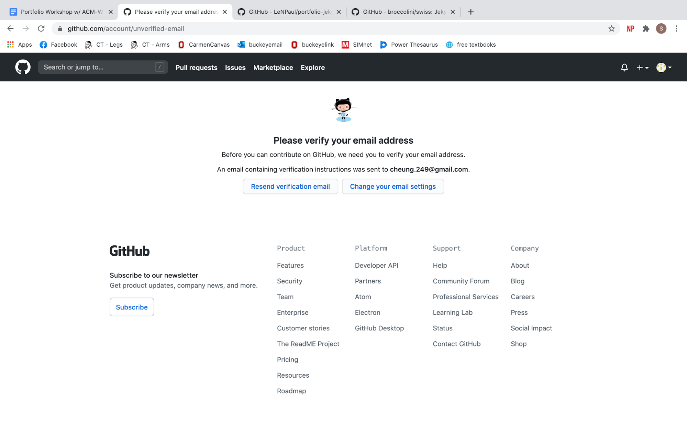
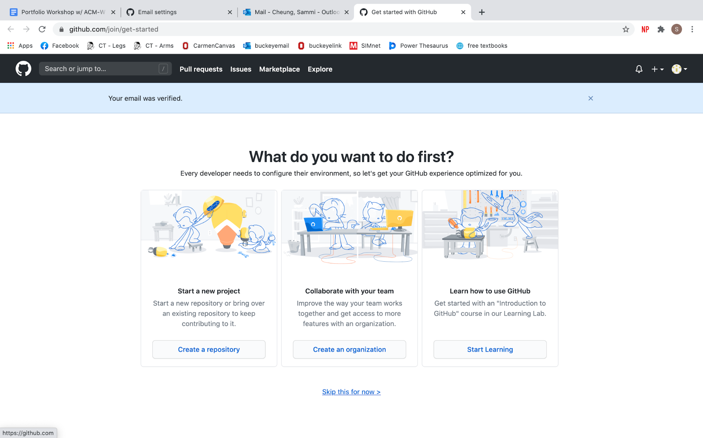
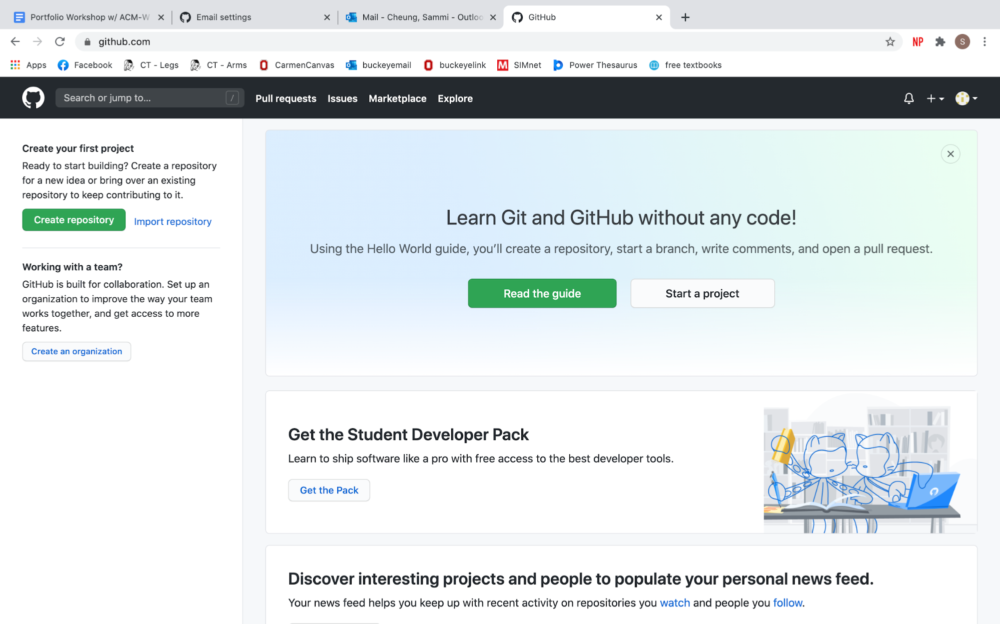

# Resume Workshop - Github Setup

*If you already have a GitHub account, please skip this page and proceed to the rest of the workshop*
Start by nagivating to [GitHub.com](https://github.com/)

* Enter your username, your preferred email, and a password
    * We recommend using your @osu.edu email, as this allows you to apply for GitHub Pro status at some point in the future, but don't worry to much about that 

* Click the "Sign Up for GitHub button"

* Follow the prompts...

* Check your email and click the link in the verification email to verify your account

* When you get to this screen, click "Skip this for now"

* Stop when you get to this screen:

----

Next: [Github Basics](github_basics)