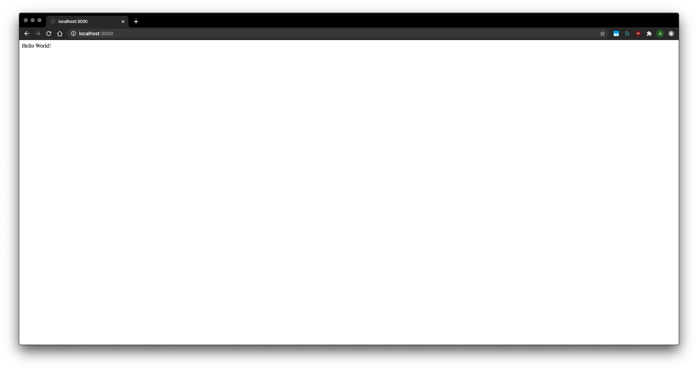

# Express and MongoDB/Mongoose Tutorial

## Objectives
* Learn what is Express and MongoDB
* How to interact with the MongoDB database using Mongoose
* Develop a simple CRUD API

## Before we get started
* Complete the node/npm tutorial
* Download [Postman](https://www.postman.com/downloads/)


## Part 1: Express

### What is Express?
Express is a Node.js web application framework that provides a robust set of features for web and mobile applications. Some of the core features
that Express offers are:
* Allows to set up [middlewares](https://expressjs.com/en/guide/using-middleware.html){:target="_blank"} to respond to HTTP requests
* Defines a routing table which is used to perform different actions based on HTTP method and URL
* Allows to dynamically render HTML pages based on passing arguments to templates


### Creating a Basic Express Application
1. Launch VS code and open the project that you created in the node/npm tutorial
2. Open a terminal in VS Code (View -> Terminal) and install Express via NPM:
    ```
    npm install express --save
    ```
3. Create a new javascript file in the root of your working directory
    - typical names are "app.js", "server.js", or "index.js" to represent the starting point of the application
4. Inside of app.js, we must import the express module:
    ```js
    const express = require('express');
    ```
5. Call the returned object to create an express application*: 
    ```js
    const app = express();
    ```
6. Then, create a [route definition/handler](#Routing) and specify the callback function that will be invoked whenever there is an HTTP `GET` request with path `'/'` relative to the site root. The callback function takes a [request and a response object](#Request-and-response) as arguments, and calls `send()` on the response with the string "Hello World!"
    ```js
    app.get('/', (req, res) => {
      res.send('Hello World!')
    });
    ```
7. Start up the server on port "3000" and print a comment to the console.
    ```js
    app.listen(3000, () => {
      console.log(`Example app listening at http://localhost:3000`)
    });
    ```
8. Save your `app.js` file and then in your terminal run the code using Node.js:
    ```
    node app.js
    ```
    You should see the following output in the terminal:
    ```
    Example app listening at http://localhost:3000
    ```
    Open a browser and navigate to [http://localhost:3000](http://localhost:3000){:target="_blank"}

Your browser should look like this:


Congrats! You now have a basic Express app which responds with "Hello World!" for requests made to the root URL (`'/'`).


\* The `app` object has methods for:
- Routing HTTP requests
- Configuring middleware
- Rendering HTML views
- Registering a template engine
- and more!

### Routing
Routing refers to determining how an application responds to a client request to a certain endpoint, which is a URI (or path) and a specific HTTP request method (e.g. GET, POST, PUT, DELETE).

Each route can have one or more handler functions, which are executed when the route is matched.

Route definitions take the following structure:
```js
app.METHOD(PATH, HANDLER)
```
where:
- `app` is an instance of `express`
- `METHOD` is an [HTTP request method](https://en.wikipedia.org/wiki/Hypertext_Transfer_Protocol#Request_methods){:target="_blank"} (in lowercase)
- `PATH` is a path on the server.
- `HANDLER` is the function executed when the route is matched.

For more information about routing, please visit the [routing guide](https://expressjs.com/en/guide/routing.html){:target="_blank"}


### Request and Response
Express applications uses a callback function whose parameters are `request` and `response` objects.
- The [request object](https://expressjs.com/en/4x/api.html#req){:target="_blank"} represents the HTTP request and has properties for the request query string, parameters, body, HTTP headers, etc...
- The [response object](https://expressjs.com/en/4x/api.html#res){:target="_blank"} represents the HTTP response that an Express app sends when that route gets a request

### Serving Static Files in Express
To serve static files such as images, CSS files, and JavaScript files, use the express.static built-in middleware function in Express by passing in the name of the directory containing your assets.

For example, if you keep your static assets in a directory named `public`, you can add the following to your `app.js` file:
```js
app.use(express.static('public'));
```
Now, you can load any files that you have in your `public` directory, by adding the file name to your root path:
- `http://localhost:3000/file_name.extension`

to see the content of the files.


### Back to the Express Application
Lets extend our application to:
- Handle other endpoints other than root (`'/'`) with other HTTP request types
- Land on a custom home page
- Utilize the express.static middleware to serve some static assets.

In the `app.js` file:
1. Create a route that responds to POST request to the root path (`'/'`) and send the message "POST request made at /"
2. Create a route that responds to a PUT request to the school path (`'/school'`) and send the message "PUT request made at /school"
3. Create a route that responds to a DELETE request to the school path (`'/school'`) and send the message "DELETE request made at /school"
4. In your root folder, create a new html file, `home_page.html` and add some content.
5. Modfy the existing `GET` route for the root path to call the `sendFile()` method of the `res` object and passing in the path of your `home_page.html` file
    * Remeber to add `__dirname` to the beginning of the file path to ensure it looks in the root of your working directory (i.e. `res.sendFile(__dirname + "home_page.html")`)
6. Create a new folder named `public` under your root project and add the following [image](../images/tutorial-5/block_o.png) 
7. Add a new HTML file in the `public` directory, `tutorial.html`, with whatever content you want
8. Use the `epxress.static` middleware to serve the files in the `public` directory
9. Save your javascript file and run it again with node. 
10. Visit the new routes and static files and ensure you see the correct messages/content:
// Add Postman information for testing the newly created routes


**//Should I add pictures for this?**
Visit the tutorial repo to view the final code


### Additional Resources
- Visit the [API Reference](https://expressjs.com/en/4x/api.html) to see everything that Express provides
- Visit the [Express examples](https://expressjs.com/en/starter/examples.html){:target="_blank"} page to get a better idea of what express allows you to do, 


## Part 2: MongoDB/Mongoose

### MongoDB
MongoDB is a general purpose, document-based, distributed database used in many modern applications. One of the key features of MongoDB is that it stores data in JSON-like documents instead of the traditional row/column model. These documents support arrays and nested objects as values making for flexible and dynamic schemas.

### Mongoose
Mongoose is an object data modeling library for MongoDB and Node.js. It manages the relationships between data, provides schema validation, and is used to translate between objects in our code and the representation of those objects in MongoDB

### Important Terminology
**Collections**
Equivalent to tables in relational databases. Can hold multiple JSON documents.

**Documents**
Equivalent to records or rows of data in SQL.

**Schema**
A document data structure (or shape of the document)

**Models**
Take a schema and create an instance of a document 

## Defining The Data - Schemas
Everything in Mongoose starts with a [Schema](https://mongoosejs.com/docs/guide.html). Let's say we want to record all the colleges in the world. To save this information into our MongoDB database, we will need to create a new Schema. Each Schema maps to a MongoDB collection and defines the shape of the documents within that collection.
```js
    const mongoose = require('mongoose');
    const Schema = mongoose.Schema;
    const schoolSchema = new Schema({
        name: String, 
        state: String,
        enrollment: Number,
        ivyLeage: Boolean,
    });
```

## Data Interaction - Models
We must compile our schema into a [Model](https://mongoosejs.com/docs/models.html) which is what is responsible for creating and reading documents from the underlying MongoDB database. From our exmaple, each document will be a school with properties and behaviors as declared in our `schoolSchema`:
```js
const School = mongoose.model('Schools', schoolSchema);
```

To create a new school document:
```js
const tOSU = new School({
    name: 'The Ohio State University',
    state: 'OH',
    enrollment: 66000,
    ivyLeage: false,
})
console.log(tOSU.name) // 'The Ohio State University'
```
We now have a object representing The Ohio State University, but haven't saved anything to MongoDB. Each document can be saved to the database by calling the `save` method. The first argument to the callback with be an error if any occured.
```js
tOSU.save((err, school) => {
    if (err) return console.error(err);
    console.log(school.name) // 'The Ohio State University'
});
```

For more information about models and the methods available, please visit the Mongoose [models page](https://mongoosejs.com/docs/models.html)

### Continuing the Express Application
1. Visit the [Getting Started](https://docs.atlas.mongodb.com/getting-started/){:target="_blank"} guide and follow parts 1-4 to set up an account and create a database with MongoDB Atlas. 

2. Next, install Mongoose via NPM:

    ```
    npm install mongoose
    ```

3. In `app.js` import the Mongoose module, similar to how we did for express:

    ```js
    const mongoose = require('mongoose');
    ```
4. Now we must open a connection to the database. Open the Connect dialog on your MongoDB cluster that you created and copy the provided connection string, replacing `<username>`, `<password>`, and `<dbname>` with your database credentials/information.
    ```js
    const db = () => {
        return mongoose.connect(mongodb+srv://<username>:<password>@<dbname>-hc9j8.azure.mongodb.net/test?retryWrites=true&w=majority), {useNewUrlParser: true, useUnifiedTopology: true});
    };
    ```
5. We now have a connection to the database and can get notified when we connect successfully:
    ```js
    db().then(async () => {
        console.log("connected to database!");
    });
    ```
6. Start the express server once the database is started now that we have established a connection (we can't run the application if there is no connection to the database!)
    ```js
    db().then(async () => {
        app.listen(3000, () => {
            console.log(`Example app listening at http://localhost:3000`)
        });
    });
    ```

7. In our working directory, we'll add new folder called `models` and add a new file in it called `schools.js` to represent how the school collection should look like. Since we're working in a new file, we'll need to import the mongoose module again. With the mongoose module imported, we can get a reference to the Schema class and define the properties for a school, compile it into a model and export the model so it can be used in other parts of the app: 
    ```js
    const mongoose = require('mongoose');
    const Schema = mongoose.Schema;
    const schoolSchema = new Schema({
        name: String, 
        state: String,
        enrollment: Number,
        ivyLeage: Boolean,
    });
    const School = mongoose.model('Schools', schoolSchema);
    module.exports = School;
    ```
8.  


