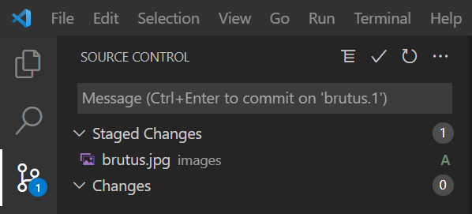

# Git and Visual Studio Code Tutorial

By: Andrew Haberlandt and [Adam Lis](https://github.com/adambricelis)

## Before we get started
* Complete the [Machine Setup tutorial](./setup)
* Accept the email invitation to our GitHub organization. If you don't have such an email, please reach out to someone on our leadership team (contact info can be found on our [homepage](../../)).

## Overview
- [Part 1: About Git](#part-1-about-git)
- [Part 2: Cloning a Repository](#part-2-cloning-a-repository)
- [Part 3: Making Modifications](#part-3-making-modifications)
- [Part 4: Commit and Push Your Changes](#part-4-commit-and-push-your-changes)
- [Part 5: Pull Request](#part-5-pull-request)

## Part 1: About Git

A "repository" consists of two parts:

- a "working tree": These are the files you have "checked out" on your computer. This is what you see in the file explorer on your operating system or the explorer pane in VS Code.
- a "history":  Stored in the `.git/` folder (*don't touch!*), Git tracks the history of all your files

(Note: This is a simplification. If you take CSE 3901/3902/3903 you will study Git in more detail.)

A "history" is a **graph** of **commits**. A **commit** (noun, also known as a "revision") is a set of changes to files in your repository, accompanied by a message describing the changes. [Here's an example commit on GitHub.](https://github.com/Code4Community/git-tutorial/commit/0ad8fd04cca43603f9660282e62b40b34c2bc213)

- A **commit** (except for the first) always has at least one parent - thus you can always trace any commit back to the single "initial" commit in any repository. So, you can see all of the changes that lead up to the current state.

- A **commit** will always be on a particular **branch** - you can think of branches as multiple independent (but connected)  parts of your "history" - this is useful if you are simulataneously working on multiple features on the same project. The default branch in Git is the `master` branch.

- "commit" is also used as a verb - meaning the act of creating a commit from your local changes (we'll use this in Part 4)

If everyone just pushed to the `master` branch, you might have a purely linear history:

```
                        [master]
                           |
* -----> * -----> * -----> * 
A        B        C        D
```

But in reality, you have multiple people working on multiple different features -- they will use different branches that can be merged together as features are finished:

```
                                      
* -----> * -----> * -----> * -------> * [master]
A \      C      / E \     F \         I
   \           /     \       \
    * ------> *       \       * -----> * [feature-2]
    B        D         \      H        J
                        \ 
                         \
                          * [feature-1]
                          G
```

This entire graph is stored in the "history".

Your local computer and the server (We use GitHub, but there are many services) might have differing histories. To sync our history with the history stored by the server, we will use two operations:

- **Push**: Push any additional commits **on the current branch** from my local history to the remote server. (If a remote branch does not exist with that name, VS Code will prompt you and it will be created on the remote server.)
- **Pull**: Pull any additional commits **on the current branch** from the remote server and store them in my local history. This also updates your **working tree** (the files you see on disk will update to reflect any changes).

**You will never be able to directly push to master.** Therefore, before pushing your code you will have to checkout a new local branch (this is covered in the later parts of this tutorial.)

Since we're using VS Code's Git interface, we won't perform push and pull operations directly. Instead, we'll click the "sync" button which performs a Git Pull and then a Git Push.

## Part 2: Cloning a repository

Git has a nice [command-line interface](https://git-scm.com/docs/gittutorial), but for the purposes of this tutorial we will be using the interface in Visual Studio Code. 

- Open Visual Studio Code, and open a new window (File -> New Window)

- Select the "Git" menu.


- Choose "Clone Repository"

- Choose "Clone from GitHub" and complete the one-time authentication process

- You should then be able to type "code4community/" and get a list of all repositories in our organization!


- Choose "code4community/git-tutorial"
    - If you can't find it, make sure you have filled out the sign-up form on our website homepage with your GitHub username. Then, contact a member of the exec board and they will ensure you are added to the GitHub organization. 

- You will be prompted to choose a location on disk to clone the repository
    - A folder named "git-tutorial" will automatically be created *within* whatever folder you select.

- After the clone is complete, you will see the the following in the lower-right:
    
    

    You likely want to choose "Open" if you followed the instructions closely, since you already have an empty window.

You should see the files for the repository, as shown in the below screenshot:


Congratulations! You succesfully cloned our repository!

You can also view the repository for this tutorial on GitHub [here](https://github.com/Code4Community/git-tutorial). All of our repositories are available on our [organization GitHub page](https://github.com/Code4Community).

Find the repository location in your operating system's finder/explorer, and open index.html in your web browser of choice. You should see the following (with the images moving around the screen):

{:style="box-shadow: 0 5px 15px grey;"}

## Part 3: Making modifications

Goal: Add yourself to our [display of bouncing heads](https://code4community.github.io/git-tutorial/)

### Step 1: Create a new branch

By default, when you clone a repository, Git checks out the `master` branch. On your local machine, you can commit to the master branch. **However, we have configured GitHub to refuse pushing to the `master` branch directly.** 

Why? It's because for all of our projects, you will be pushing to separate branches for each feature you work on. You will then create a **pull request** in GitHub, requesting that *your peers review your code* before it gets merged into the `master` branch.

- Select the "master" button in the bottom bar of VS Code


- Select "Create new branch..."


- Give your branch a unique name. For the purposes of this tutorial, just use your name.#

- Verify in the bottom bar that your new branch name is displayed instead of "master".


### Step 2: Add your image

Add an image to the `images/` directory. You can drag-and-drop from the file explorer on your operating system directly into VS Code.

Note: Your image does not have you be an actual picture of yourself, although it might help us learn each other's names.


## Part 4: Commit and push your changes


Things to note:
- The "U" next you the image you added means this file is `U`ntracked - we haven't told Git to track changes to this file yet. The file is brand-new and has no history.


### Step 1: "Stage" your changes

Switch to the Git pane, and you'll see only the files with changes in your working copy.


- Press the "+" on the file you'd like to commit. Or, select "+" next to "Changes" to add all changes.


Now, you should see:



Note: the "U" next to the image has changed to an "A" for `A`dded, now that we have added this file to Git.

### Step 2: Commit your changes

Add a commit message (this should briefly explain your changes):


Press the checkmark:


### Step 3: Push your changes

- Look in the bottom bar. You should see something like this (it will say your branch name rather than brutus.1):
    
    

- Press the cloud with an upward arrow. This pushes your changes to GitHub.

    

## Part 5: Pull Request

[Example Pull Request](https://github.com/Code4Community/git-tutorial/pull/1)

### Step 1: Create your pull request

If you pull up the [repository](https://github.com/Code4Community/git-tutorial) in a browser, you might see the following (with your branch name):


If so, you can click "Compare & Pull request" and it save you a few clicks.

Otherwise:
- Go to the [repository homepage](https://github.com/Code4Community/git-tutorial)
- Click "Pull Requests"
- Click "New Pull Request"

You'll see something like this:


- "base" is the branch you want you merge your changes *into*
- "compare" is the branch your changes are currently on (this is the branch you created earlier)

So,

- All you have to do is change the "compare" branch to your branch, and click "Create pull request".
    - If you can't find your branch, that means you didn't successfully push your changes in the previous part. Let us know and we will help you.
- Give your pull request a title and leave a comment with any issues you had
- Click "Create pull request" (again)

For this repository, you need **at least two approvals** before you can merge your pull request into master.
- We encourage you to seek approvals from others completing the tutorial
- Request your reviews here:

    {:style="height: 50vh;"}

### Step 2: Review other pull requests
* Choose one of your peers' [pull requests](https://github.com/Code4Community/git-tutorial/pulls)
* Click on the "Files changed" tab
* Look over their changes
* Click "Review changes"
* If you think their changes look good...
    1. Leave them a nice comment (e.g. "Good job!", "Nice work!", "LGTM!")
    1. Click "Approve"
    1. Click "Submit review"
* If you think there are issues with their changes
    1. Leave them a friendly comment explaining the issue
    1. Click "Request changes"
    1. Click "Submit review"

Please review multiple pull requests so everyone can merge their PR :)

### Step 3: Merge your pull request
Hopefully, you now have two approvals on your PR
* If not, you'll see this:

  {:style="width: 50vw;"}

* If so, you'll see this: 

  {:style="width: 50vw;"}

* If you have two approvals, click the big green merge button!

## That's it!

Now you should be able to see your changes live on [https://code4community.github.io/git-tutorial/](https://code4community.github.io/git-tutorial/)!

# Feedback

If you have any feedback for this tutorial, please [create a GitHub issue](https://github.com/Code4Community/Code4Community.github.io/issues/new) or talk to one of the leaders of C4C.
