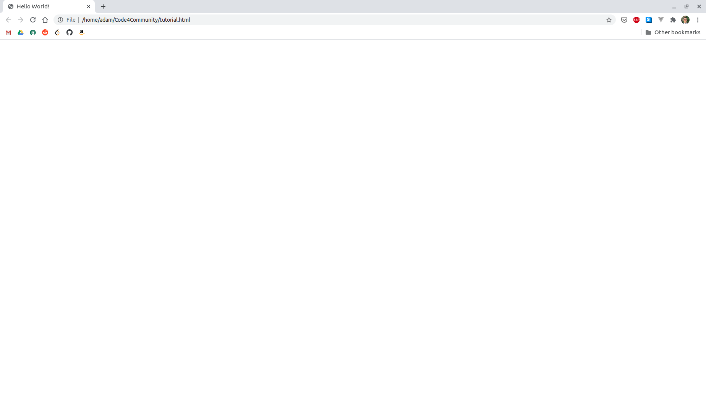
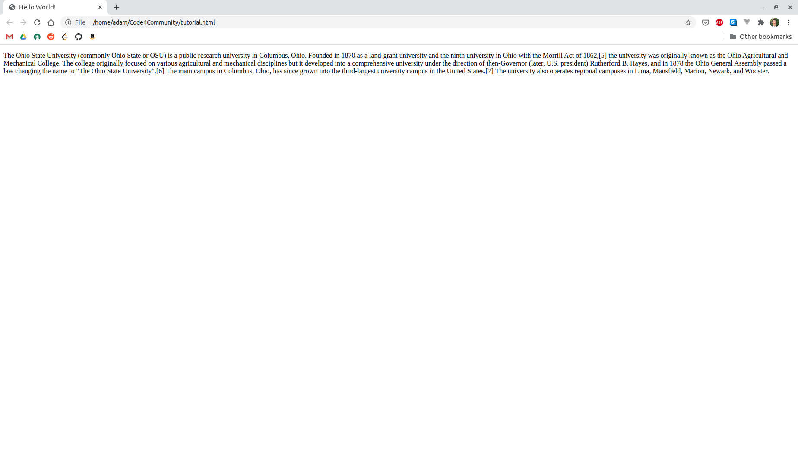
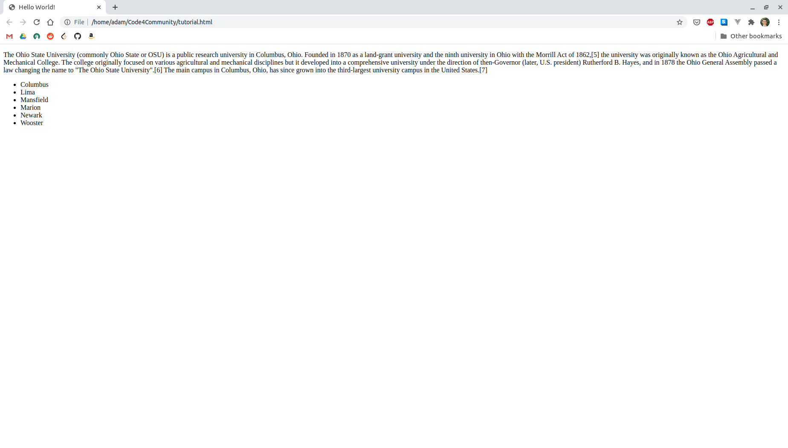
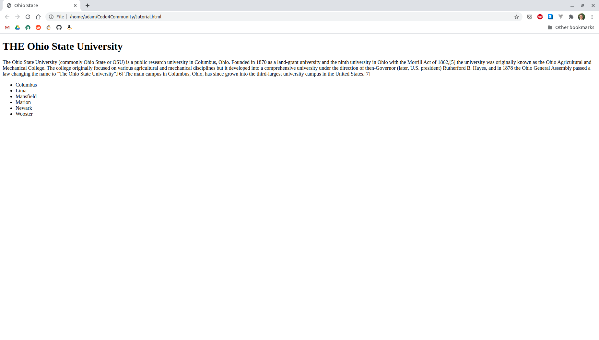
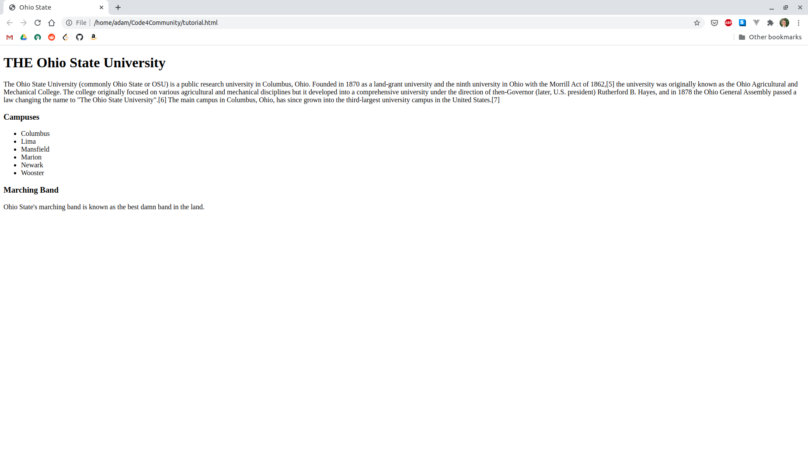
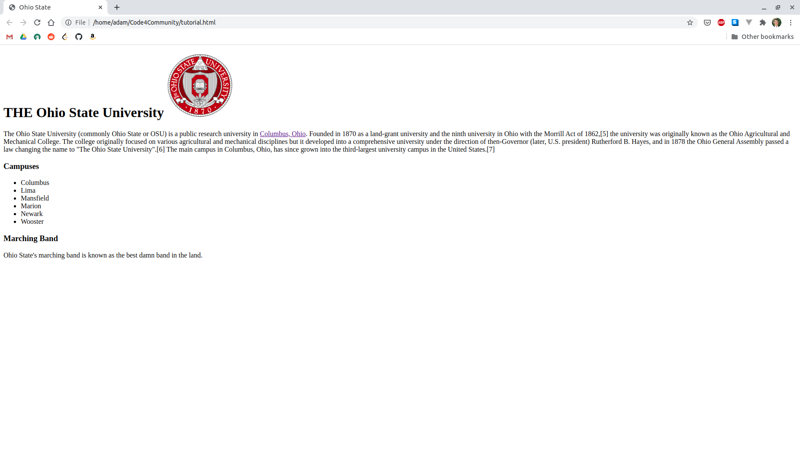
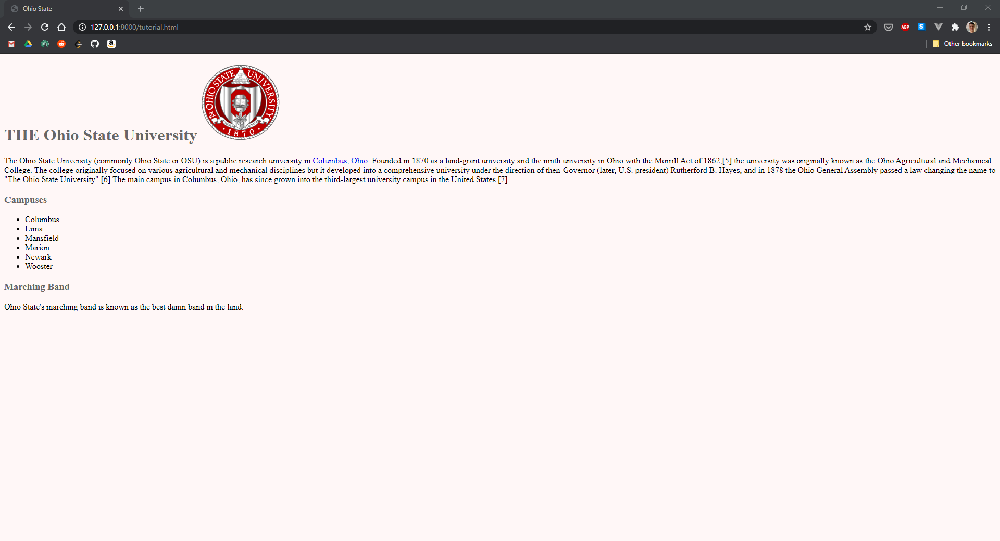
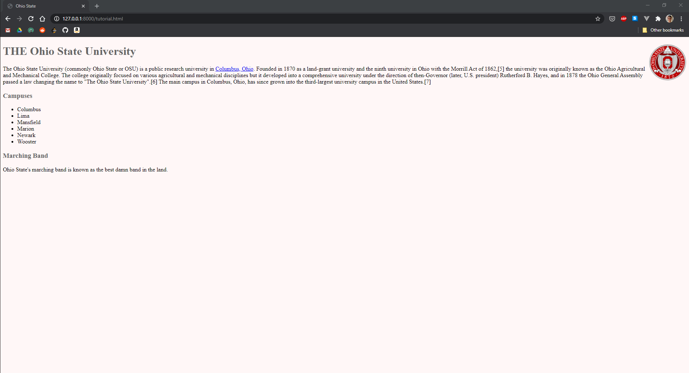
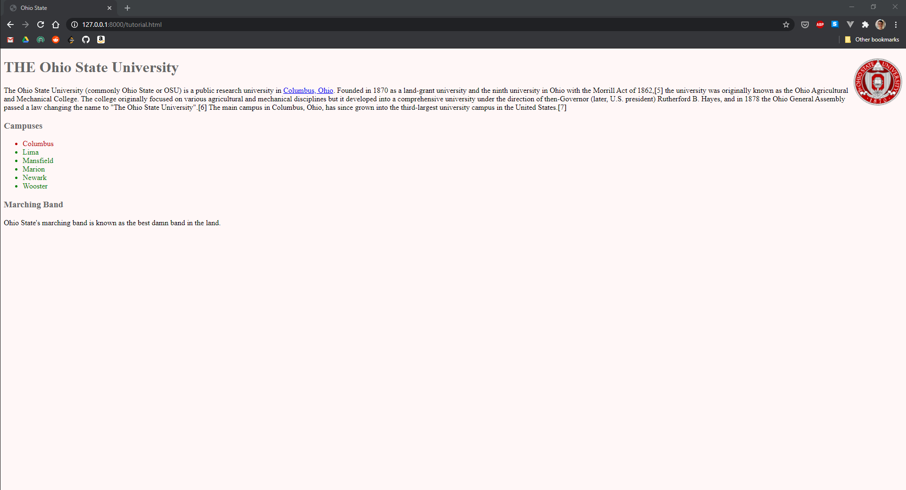
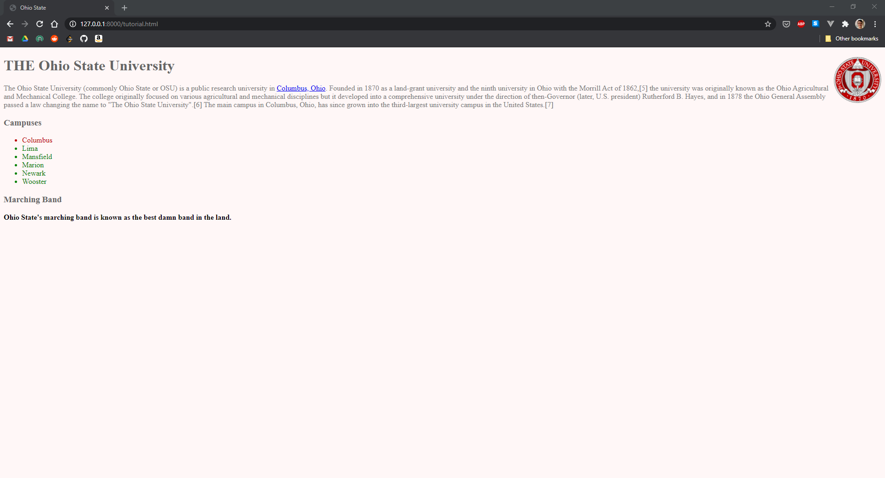

<style>
    h1 {
        margin-top: 0 !important;
    }
    img {
        box-shadow: 0 5px 15px grey;
    }
</style>

# HTML and CSS Tutorial

By: [Adam Lis](https://github.com/adambricelis)

## Before we get started
* Complete the [Git and VS Code tutorial](./git)
* When you reach a checkpoint, please compare your webpage with the screenshot provided. If they don't match up, ask for help!

## Overview
* [Part 1: Why do we need HTML, CSS, *and*, JavaScript?](#part-1-why-do-we-need-html-css-and-javascript)
* [Part 2: HTML](#part-2-html)
* [Part 3: CSS](#part-3-css)

## Part 1: Why do we need HTML, CSS, *and*, JavaScript?
If you have prior experience with programming languages like Java or Python, you've probably written entire applications in one programming language. This begs the question in the title of this section: why does writing webpages involve using *three* programming languages?

Every webpage has to answer a few different questions before it can be displayed in your browser.

1. What am I displaying?
1. How am I displaying it?
1. How do I respond to user interaction?

Each of these questions is answered by one of the languages of the web. HTML knows what to display, CSS knows how to display it, and JavaScript knows how to respond to user interaction. Without HTML, your webpage has no content. Without CSS, your webpage looks like [this](https://www.berkshirehathaway.com/). Without JavaScript, users can't *do* anything other than look at your site (which is okay for some sites, but not for others). When building a website, it's best to keep your HTML, CSS, and JavaScript in separate files. However, we're going to keep everything in one file during these tutorials for the sake of simplicity.

## Part 2: HTML

### Background
HTML stands for Hypertext Markup Language. A "markup language" is not a programming language. Rather, it's a way of annotating, or "marking up" text with formatting information. The formatting information is interpreted by a program (in this case, a browser) and then displayed to your screen.

You "mark up" text in HTML using tags. An opening tag looks like `<tag>`, it's a tag name with an angle bracket on each side. A closing tag looks like `</tag>`, it's a forward slash and a tag name with an angle bracket on each side. Let's say that you want to display the text "Go Bucks". You might want to display that as a header, paragraph, or a link. Your decision on that front would dictate which tag you would use. If you want a header, then you'd put `<h1>Go Bucks</h1>`. If you want a paragraph, then you'd put `<p>Go Bucks</p>`.

Every HTML page should look something like this. The `<!DOCTYPE html>` tag tells the browser we're writing HTML5 (the latest version of HTML). The `<head></head>` tag tells the browser about our webpage (this information is called metadata). The `<body></body>` tag tells the browser what to display on our webpage.
```html
<!DOCTYPE html>
<html lang="en">
    <head>
        <title>Hello World!</title>
    </head>
    <body>
    </body>
</html>
```

### Getting Started
1. Open a new VS Code window. (Go to File -> New Window)
1. Click 'Open Folder'. Create a folder somewhere on your computer for this tutorial, and then select that folder.
1. Create a file named `tutorial.html`
    - File > New File > tutorial.html
1. Copy the skeleton code from above into this file
1. Save this file somewhere on your computer
    - Ctrl + S or Command + S
1. Open `tutorial.html` in a web browser
    1. Right click the `tutorial.html` tab at the top of the screen in VS Code
    1. Click "Reveal in Explorer" or "Open Containing Folder"
        - This will depend upon your operating system (Windows, macOS, Linux)
    1. Double click `tutorial.html` in your file explorer
        - This should open the file in your default web browser

Checkpoint 1:



Congrats! You have a webpage! Although...it's pretty boring. Let's change that by adding some content.

### Adding Content
HTML has many different tags we can use to display different information. There are tags for headers, paragraphs, lists, navigation, links, images, forms, and all sorts of other things. We'll just cover a few today, although you can read about [all of HTML's tags](https://developer.mozilla.org/en-US/docs/Web/HTML/Element) if you'd like to learn more.

Let's start with a paragraph. Put a [`<p></p>` tag](https://developer.mozilla.org/en-US/docs/Web/HTML/Element/p) inside of the `<body></body>` tag and put some text between the opening (`<p>`) and closing (`</p>`) tags. Let's use the first paragraph on [Ohio State's Wikipedia page](https://en.wikipedia.org/wiki/Ohio_State_University) to make things easy.

**Note: VS Code will automatically add the `</p>` end tag as you type the `<p>` start tag. You won't need to explicitly type this.**

Checkpoint 2:



At the end of that paragraph from Wikipedia, there's a list of regional campuses. Let's take that sentence out of our paragraph and move it into a list of campuses. HTML has two types of lists: [ordered](https://developer.mozilla.org/en-US/docs/Web/HTML/Element/ol) `<ol></ol>` and [unordered](https://developer.mozilla.org/en-US/docs/Web/HTML/Element/ul) `<ul></ul>`. Since there isn't any particular order to the campuses, we'll use an unordered list. Put it inside of the body tag but after the paragraph tag. Then, put each campus in a list item tag (`<li></li>`) between the opening (`<ul>`) and closing (`</ul>`) list tags. Don't forget to add Columbus to the list!

Checkpoint 3:



Since this webpage is taking on an Ohio State theme, we should probably update the title and add a header. Change the contents of the title tag from "Hello World!" to "Ohio State". There are six [header tags](https://developer.mozilla.org/en-US/docs/Web/HTML/Element/Heading_Elements) in HTML, `<h1></h1>`...`<h6></h6>` with h1 tags being the largest headers and h6 tags being the smallest headers. Let's add an h1 tag to top of our webpage with the text "THE Ohio State University". Make sure to put it inside of the body tag but before the paragraph tag.

Checkpoint 4:



Since we're making a website about Ohio State, we *have* to mention the marching band. Let's add a paragraph at the bottom of the page that says "Ohio State's marching band is known as the best damn band in the land." While we're at it, we should add a couple headers: one for our list of campuses and one for the marching band. Put an h3 tag that says "Campuses" before the list of campuses, and put an h3 tag that says "Marching Band" before the paragraph about the marching band. Make sure not to put those inside of any tags other than the body tag.

Checkpoint 5:



Lastly, we're going to add an image (``) and a link (`<a></a>`) to our page. Thus far, we've only dealt with tags that have text inside. However, these last two tags are a little bit different. The anchor (link) tag has opening and closing tags, but the image tag doesn't. And both of them require you to set attributes to make them useful. Here's the syntax for setting a tag attribute in HTML: `<tag attribute="value"></tag>` or `<tag attribute="value">`. Each tag can have zero or more attributes.

Add an [image tag](https://developer.mozilla.org/en-US/docs/Web/HTML/Element/img) inside of the h1 tag after "THE Ohio State University". Set its `src` attribute to "https://upload.wikimedia.org/wikipedia/en/thumb/e/e1/Ohio_State_University_seal.svg/150px-Ohio_State_University_seal.svg.png", the URL of OSU's seal on Wikipedia. This attribute tells the browser where to find the image you'd like to display. Set the `alt` attribute to "University Seal". This attribute is important for accessibility because visually impaired people browse the web using [screen readers](https://en.wikipedia.org/wiki/Screen_reader). It also tells the browser what to display if the browser cannot retrieve the image.

Add an [anchor tag](https://developer.mozilla.org/en-US/docs/Web/HTML/Element/a) around "Columbus, Ohio" in the paragraph about Ohio State from Wikipedia. Set its `href` attribute to "https://www.columbus.gov/", Columbus's website.

Checkpoint 6:



### Result
Your code should look something like this:
```html
<!DOCTYPE html>
<html lang="en">
    <head>
        <title>Ohio State</title>
    </head>
    <body>
        <h1>
            THE Ohio State University
            
        </h1>
        <p>The Ohio State University (commonly Ohio State or OSU) is a public research university in <a href="https://www.columbus.gov/">Columbus, Ohio</a>. Founded in 1870 as a land-grant university and the ninth university in Ohio with the Morrill Act of 1862,[5] the university was originally known as the Ohio Agricultural and Mechanical College. The college originally focused on various agricultural and mechanical disciplines but it developed into a comprehensive university under the direction of then-Governor (later, U.S. president) Rutherford B. Hayes, and in 1878 the Ohio General Assembly passed a law changing the name to "The Ohio State University".[6] The main campus in Columbus, Ohio, has since grown into the third-largest university campus in the United States.[7]</p>
        <h3>Campuses</h3>
        <ul>
            <li>Columbus</li>
            <li>Lima</li>
            <li>Mansfield</li>
            <li>Marion</li>
            <li>Newark</li>
            <li>Wooster</li>
        </ul>
        <h3>Marching Band</h3>
        <p>Ohio State's marching band is known as the best damn band in the land.</p>
    </body>
</html>
```

Nice job! Now you know some basic HTML. However, our website is still a bit bland. I know what'll do the trick...

## Part 3: CSS

### Background
CSS stands for Cascading Style Sheets. It is also known as "styling". The "cascade" portion of the title is beyond the scope of this tutorial, but you can [read about it](https://developer.mozilla.org/en-US/docs/Web/CSS/Cascade) if you'd like to learn more.

When you're styling a webpage with CSS, you create rules which tell the browser how your webpage should be displayed. Each rule consists of one or more selectors and one or more declarations. Multiple selectors are separated by commas and multiple declarations are separated across multiple lines. We'll get into the syntax for selectors and declarations in a moment, but here's the CSS rule syntax:
```css
selector-1, selector-2 {
    declaration-1
    declaration-2
}
```

#### Selectors
Selectors allow you to specify *what* elements you're styling. The basic selectors are types, classes, and IDs. You can read more about [the other types of selectors](https://developer.mozilla.org/en-US/docs/Web/CSS/CSS_Selectors) if you'd like to learn more. In CSS, types are specified as tag names like `p`, `h3`, and `img`. Classes and IDs are attributes, so I hope you were paying attention when we went over those earlier. You add classes and IDs to tags just like any other attributes: `<tag class="my-class"></tag>` or `<tag id="my-id"></tag>`. In CSS, classes are specified with a dot prefix like `.my-class` and IDs are specified with a hash prefix like `#my-id`. You can have multiple elements that use the same type and multiple elements that have the same class, but you can only have one element with a given ID. *That's why they're called IDs, they must be unique.*

#### Declarations
Declarations allow you to specify *how* you want elements to be styled. Each declaration consists of a property and a value. There are [numerous CSS properties](https://www.w3schools.com/cssref/), so we'll only touch on a few in this tutorial. This is the CSS declaration syntax: `property: value;`. Properties and values are separated by a colon, and each declaration ends with a semicolon.

### Adding styling
Since this is a pretty simple webpage, we'll be adding styling inside of our `.html` file. However, it's best to use [external CSS files](https://www.w3schools.com/css/css_howto.asp) in your future web development endeavors.

Start by adding a `<style></style>` tag inside of the head tag. This is where we'll put all of our CSS rules.

For our first CSS rule we'll change the background color of our website. Since we want to apply this to the whole page, we need to style the `body` tag. Set the `background` property to `#fff7f7`, a nice light reddish pink color I found. This is a hexadecimal color, although there are [many different ways to specify CSS colors](https://www.w3schools.com/cssref/css_colors_legal.asp).

Checkpoint 7:


Next, we'll make the headers [Ohio State gray](https://brand.osu.edu/color/). Since we have `h1` and `h3` tags on our webpage, we need to set the `color` property to `#666` for both. Remember, you should be able to do this with a single CSS rule.

Checkpoint 8:



Our university seal is great and all, but it's currently too big and not in the right spot on our webpage. Making it smaller and moving it to the right side of the page would be ideal. Since it's the only image on the page, we can style the `img` tag. Set the `float` property to `right` and set the `height` property to `100px`. The height and width properties are set to `auto` by default, so the image's width was automatically scaled down to maintain the image's [aspect ratio](https://en.wikipedia.org/wiki/Aspect_ratio). There are many ways to do layouts in CSS that are better than `float`s, but this solution is quick and simple. Go down the [CSS layout rabbit hole](https://developer.mozilla.org/en-US/docs/Learn/CSS/CSS_layout) at your own risk.

Checkpoint 9:



Now our webpage looks pretty good! But that list of campuses is still pretty boring. Let's make Columbus red and the regional campuses green (sorry not sorry, Columbus is the best). We're gonna need to use some of those cool CSS classes and IDs we talked about earlier. Give the li tag for Columbus the id `main-campus` (since there's only one). Give the li tags for the regional campuses the class `regional-campus`. Now we can style our list of campuses. For the main campus, set the `color` property to `#bb0000`, [Ohio State red](https://brand.osu.edu/color/). For the regional campuses, set the `color` property to `green`.

Checkpoint 10:



For our last styling task, we're going to touch on [CSS specificity](https://developer.mozilla.org/en-US/docs/Web/CSS/Specificity). This topic is pretty advanced, so don't worry if it fails to sink in this time around. First, let's make the paragraphs gray. Style the `p` tag, setting the `color` property to `gray`. Now both paragraphs should be gray. However, we really want to emphasize that our band that is the best damn band in the land, so let's make that paragraph black and bold. Add the `band-info` id to the p tag under the Marching Band header. Style that id by setting the `color` property to `black` and setting the `font-weight` property to `bold`. Now the first paragraph should be gray, while the second one should be black and bold. You should read more about specificity if you're going to be writing more CSS, but I'll give you the abbreviated version now. Styling an ID is more specific than styling a class, styling a class is more specific than styling a type (tag name). So the `#band-info` style for `color` overrides the `p` style for `color`.

Checkpoint 11:



Great job! Now you know some basic CSS.

### Result
Your code should look something like this:
```html
<!DOCTYPE html>
<html lang="en">
    <head>
        <title>Ohio State</title>
        <style>
            body {
                background-color: #fff7f7;
            }
            h1, h3 {
                color: #666;
            }
            img {
                float: right;
                height: 100px;
            }
            #main-campus {
                color: #bb0000;
            }
            .regional-campus {
                color: green;
            }
            p {
                color: gray;
            }
            #band-info {
                color: black;
                font-weight: bold;
            }
        </style>
    </head>
    <body>
        <h1>
            THE Ohio State University
            
        </h1>
        <p>The Ohio State University (commonly Ohio State or OSU) is a public research university in <a href="https://www.columbus.gov/">Columbus, Ohio</a>. Founded in 1870 as a land-grant university and the ninth university in Ohio with the Morrill Act of 1862,[5] the university was originally known as the Ohio Agricultural and Mechanical College. The college originally focused on various agricultural and mechanical disciplines but it developed into a comprehensive university under the direction of then-Governor (later, U.S. president) Rutherford B. Hayes, and in 1878 the Ohio General Assembly passed a law changing the name to "The Ohio State University".[6] The main campus in Columbus, Ohio, has since grown into the third-largest university campus in the United States.[7]</p>
        <h3>Campuses</h3>
        <ul>
            <li id="main-campus">Columbus</li>
            <li class="regional-campus">Lima</li>
            <li class="regional-campus">Mansfield</li>
            <li class="regional-campus">Marion</li>
            <li class="regional-campus">Newark</li>
            <li class="regional-campus">Wooster</li>
        </ul>
        <h3>Marching Band</h3>
        <p id="band-info">Ohio State's marching band is known as the best damn band in the land.</p>
    </body>
</html>
```

Now that you've completed this tutorial, you have your own little static webpage!

# Resources
* HTML
    * [W3Schools](https://www.w3schools.com/html/)
* CSS
    * [MDN](https://developer.mozilla.org/en-US/docs/Web/CSS)
    * [W3Schools](https://www.w3schools.com/css/)
    * [CSS-Tricks](https://css-tricks.com/)

# Feedback
If you have any feedback for this tutorial, please [create a GitHub issue](https://github.com/Code4Community/Code4Community.github.io/issues/new) or talk to one of the leaders of C4C.
