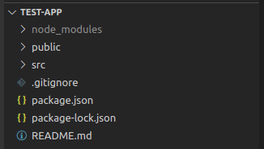
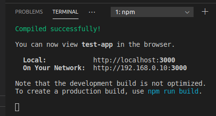
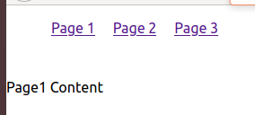
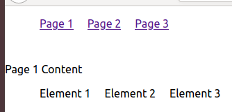

<style>
    img {
        box-shadow: 0 5px 15px grey;
    }
</style>

# Tutorial: React and JSX

By: Anden Acitelli

Reviewed by: 

## Prerequisite Knowledge

- **JavaScript:** You don't need to be an expert, but you need to understand the syntax of JavaScript to understand React. The JavaScript tutorial completed previously is recommended if you are unfamiliar, and you should skim it over even if you already familiar.
- **HTML/CSS:** You will need to understand HTML to understand JSX (explained later), and you will need to understand CSS to understand SCSS (explained later). React itself requires neither, but you will want to have a good foundation to understand it all together.


## Setup

To use React, you will need:
- [Node](https://nodejs.org), which is likely already installed as part of previous tutorials
- npm (node package manager), which comes installed with Node.

## Overview

### What Does This Tutorial Cover?

This tutorial is intended to get a new Code 4 Community up to speed with what they need to know in order to start contributing code to the Mindup! application. The skills necessary are taught through a webapp you will be building concurrently with the tutorial, with screenshots included at the end of each section so that you can verify that your code works as intended.

### Outline

- [Part 1: What Are React and JSX?](#part-1-what-are-react-and-jsx)
- [Part 2: Set Up And Run A React Application](#part-2-set-up-and-run-a-react-application)

- [Part 3: React](#part-3-react-components)
- [Part 4: Mindup-Specific React Details](#part-5-mindup-specific-react-details)

- [Part 5: Optional Topics to Learn](#part-6-optional-topics-to-learn)
- [Part 6: Other Resources](#part-7-other-resources)

## Part 1: What Are React And JSX?

Before we get into making your own application, a little background information is helpful. 

### React 

[React](https://reactjs.org/) is a JavaScript framework developed and maintained by Facebook and a group of open-source developers. It is generally regarded as the most popular web development framework, especially at smaller companies, but is rivaled by Angular and Vue. There is great reading out there about the differences between them and the advantages of each, but that is beyond the scope of this tutorial. 

As a taste of what's to come, here is a "Hello, World!" page in React: 

```javascript
import React from 'react'
class HelloWorld extends React.Component {
    render() {
        return <h1>Hello, Mindup Contributor!</h1>
    }
}
```

### JSX 

JSX is a version of HTML used by React that lets you plug JavaScript variables directly into the HTML. This is what enables React to do implicit DOM Manipulation. If you don't know what that means, that's fine, but if you're curious, look up "JavaScript DOM Manipulation"; React does that all for us.

## Part 2: Set Up And Run A React Application

### Set Up A Baseplate React Application

Setting up a React project from scratch manually is difficult, but React has an easy way to create a basic application with all the core functionality needed to take away all that overhead.

To do this, simply verify `npm` is installed and execute `npx create-react-app test-app` in a terminal. As a reminder the hotkey to toggle VSCode's integrated terminal is `Ctrl + Tilde` (`Tilde` is the character above `Left Tab`).

This line uses npx (an npm-related service that is installed with npm) to run `create-react-app`, which is a preregistered command that creates a directory with the name of the third parameter (i.e. `test-app` above) and populates that directory with the baseplate React application itself. It will likely take a few minutes; That is expected.

After it finishes, if you open the folder (`test-app`) for the application in VSCode, it should look like the following: 



### Run A React Application

To run the application, first ensure you are in the application's base directory. This will usually be the directory with `package.json` in it. Then, run `npm run start` in a terminal.

If you are on Linux and run into a "System limit for number of file watchers reached" error, run `echo fs.inotify.max_user_watches=524288 | sudo tee -a /etc/sysctl.conf && sudo sysctl -p` in a terminal to raise your number of file watchers. You likely just have to restart your terminal, but may have to restart your computer to apply this change.

You will then see some terminal output, which is React starting the development server (which lets us hot-reload code without having to refresh the browser) and then loading our project into it. If you did everything right, you should see something like this:



What the command `npm run <command>` does is go to the `package.json` file, go to the `scripts` section, and runs whatever corresponds to the command there. There's some weird stuff that goes in with environment variables (which is why straight-up running these commands instead of doing it through `npm run start` often doesn't work) but that's beyond scope of this tutorial.

### Exploring The Parts Of Our Application

We start in our base directory. `node_modules` is all the JavaScript prerequisites that React has. `public` generally holds any pictures we use. `src` holds all our actual code, which we will go more in-depth into momentarily. `package.json` holds information about our projects npm dependencies and associated scripts. `package-lock.json` holds information about the versions of prerequisites our project can run on.

Inside the `src` directory, there are some important parts. `index.js` is the very first file that React tries to run. We generally never edit this. This file includes `App.js`, which is the "base" of our entire application. In context to Mindup, this is where we do routing, meaning it's where we make the decision to display certain pages ("components") when the user is at certain URLs. 

Any other files are either related to styling, or are beyond the scope of this application. Looking them up is sure to give you useful knowledge, but they haven't really been a part of the project up to this point.

## Part 3: React

It's time to get into the meat of React! 

React, like most other broadly-scoped web frameworks, offers templating - The ability to duplicate the same bit of code across multiple sections while being able to edit it all in one place. It does this via **components**. You can view a component as a section of a page that has its own Layout (the HTML), Styling (the css), and Behavior (the JavaScript).

Each component gets its own JavaScript file. You can technically create multiple in one file, similar to how you can often declare multiple classes in the same file in a lot of Object-Oriented Languages, but it's not recommended from a maintainability standpoint.

### Creating Our First Component 

We will start by making a basic Navbar, using templating to display it across several pages, while only having one Navbar file.

First, before we create the Navbar itself, we need to configure routing, so we can actually map routes to React components. We do this through an npm package called React Router. 

To install `react-router`, execute `npm install react-router-dom` in a terminal. 

Then, modify your `App.js` file to look like the following:

```javascript
import React from 'react';
import 
{ 
  BrowserRouter,
  Switch, 
  Route
} from "react-router-dom";

import Page1 from "./Page1";
import Page2 from "./Page2";
import Page3 from "./Page3";

class App extends React.Component {
    render() {
        return (
            <BrowserRouter>
                <div>
                    <Switch>

                    <Route exact path="/page1">
                        <Page1 />
                    </Route>

                    <Route exact path="/page2">
                        <Page2 />
                    </Route>

                    <Route exact path="/page3">
                        <Page3 />
                    </Route>

                    </Switch>
                </div>
            </BrowserRouter>
        );
    }  
}

export default App;
```

Please note that the parenthesis after the return statement *needs* to be on the same line, which is the only place you actually need to adhere to a brace style in React in my experience. Otherwise, JavaScript will automatically insert a semicolon right after the return statement, which will return nothing and ignore all the JSX after the return.

All this does is map the `/page1` route to the Page1 component and so on with the other two pages. The "switch" here is similar to a switch statement in other languages.

It's important to note that, when you initially ran `create-react-app`, this component was generated as a "stateless functional" component, which means it is quicker to load but can't handle any state (think stuff like if the user is logged in). The version of `App.js` above is the normal React component.

Now, let's actually make the Page1/Page2/Page3 components. We will create these ones as stateless functional components. Create the files `Page1.js`, `Page2.js`, and `Page3.js` in `src`. Fill them with the following: 

**Page1.js**
```javascript
import React from "react";
export default function Page1() {
    return (
        <div>Page1 Content</div>
    )
}
```

**Page2.js**
```javascript
import React from "react";
export default function Page2() {
    return (
        <div>Page2 Content</div>
    )
}
```

**Page3.js**
```javascript
import React from "react";
export default function Page3() {
    return (
        <div>Page3 Content</div>
    )
}
```

Now, to make sure routing is working, start up your react app (`npm run start`) and go to the `/page1` route. This is just whatever localhost port your server started on (generally 3000, unless something else was running there). In that case, the full path would be `localhost:3000/page1`. It should say "Page 1 Content" on the screen. Check the `/page2` and `/page3` routes to make sure they say "Page 2 Content" and "Page 3 Content" as well. If they do, routing is set up correctly.

Now, we will add a very basic Navbar component that will be displayed across all of those pages. In `src`, create a file `Navbar.js` and place the following code inside it:

```javascript
import React from 'react';
import "./navbar.css"
export default function Navbar() {
    return (
        <nav>
            <ul>
                <li><a href="/page1">Page 1</a></li>
                <li><a href="/page2">Page 2</a></li>
                <li><a href="/page3">Page 3</a></li>
            </ul>
        </nav>
    )
}

```

Note the importing of a css sheet. Now we need to actually create that css file, `navbar.css`:

```css
nav {
    width: 100%;
}

ul {
    list-style-type: none;
}

li {
    display: inline-block;
    height: 50px;
    padding: 0 10px;
}
```

We then must edit `Page1.js`, `Page2.js`, and `Page3.js` to actually display the Navbar component. The change to `Page1.js` is shown here:

```javascript
import React from "react";
import Navbar from "./Navbar"
export default function Page1() {
    return (
        <div>
            <Navbar />
            <div>Page1 Content</div>
        </div>
    )
}
```

Notice how we import and use the Navbar component. Simply replicate the changes we made here to `Page2.js` and `Page3.js`. 

When this is all done, each page should look something like the following: 



### Props

Now, having to go in and change each of Page1, Page2, and Page3 was annoying. Because they are all identically structured, and the only difference is the text, what if we could just "pass in" that text, and use only one component?

React has this in the form of **props**. Props are really similar conceptually to passing in parameters to a function. Lets go ahead and make that change!

Go ahead and delete `Page2.js` and `Page3.js`. Rename `Page1.js` to `Page.js`; We will be modifying that component to move all the pages' functionality into one page.

First, we will modify `Page.js`. Change it to the following:

```javascript
import React from "react";
import Navbar from "./Navbar"
export default function Page(props) {
    return (
        <div>
            <Navbar />
            <div>{props.text}</div>
        </div>
    )
}
```

We made the following changes: 
- Change the name of the Component (the name of the function) to reflect the name of the file (generally good practice)
- Add a "props" parameter. This is a JSON object that holds the stuff we passed in. We will cover how to actually pass in stuff shortly.
- Pull the "text" field from that component, and display it in the HTML. The brackets are used to tell React "hey, we want to do JavaScript here, not HTML". This is the main usage of JSX.

Next, we have to modify `App.js` to fix the routing. However, because we only have one component, we can't still do the "one route to one component" thing. We instead **pass in props**. 

Change `App.js` to the following: 

```javascript
import React from 'react';
import 
{ 
  BrowserRouter,
  Switch, 
  Route
} from "react-router-dom";

import Page from "./Page";

function App() {
  return (
    <BrowserRouter>
      <div>
        <Switch>

          <Route exact path="/page1">
            <Page text="Page 1 Content"/>
          </Route>

          <Route exact path="/page2">
            <Page text="Page 2 Content"/>
          </Route>

          <Route exact path="/page3">
            <Page text="Page 3 Content"/>
          </Route>

        </Switch>
      </div>
    </BrowserRouter>
  );
}

export default App;
```

We simply update our imports, and pass in a field called `text` to our component. If you wanted to add more fields, it would look something like the following:

```javascript
<Page text="Page 3 Content" otherText="Page 3 More Content">
```

And then the component itself:

```javascript
function Page(props) {
    return (
        <div>
            <Navbar />
            <div>{props.text}</div>
            <div>{props.otherText]</div>
        </div>
    )
}
```

You don't need to make those changes to your app, but you should understand how to do it.

Now, when you check your app, it should show the same as before, and routing should work the same. The true benefit of this is that we only have to change one file to make any changes now.

Props should be used whenever we want several pages (or versions of the same page) to have the same structure (the same HTML), but differ in terms of text or other small things. You can pass in basically any kind of JavaScript variable in as a prop, so there's a lot of possibilities.

Now, say that, instead of displaying a single piece of text, we want to display an array of text (i.e. pass in an array as a prop)? 

First, let's modify `App.js` to change what we pass in: 

```javascript
import React from 'react';
import 
{ 
  BrowserRouter,
  Switch, 
  Route
} from "react-router-dom";

import Page from "./Page";

function App() {
  var listOfElements = ["Element 1", "Element 2", "Element 3"]
  return (
    <BrowserRouter>
      <div>
        <Switch>

          <Route exact path="/page1">
            <Page text="Page 1 Content" list={listOfElements}/>
          </Route>

          <Route exact path="/page2">
            <Page text="Page 2 Content" list={listOfElements}/>
          </Route>

          <Route exact path="/page3">
            <Page text="Page 3 Content" list={listOfElements}/>
          </Route>

        </Switch>
      </div>
    </BrowserRouter>
  );
}

export default App;
```

Then, let's change the `Page` component to actually render a list of whatever was passed in:

```javascript
import React from "react";
import Navbar from "./Navbar"
export default function Page(props) {
    return (
        <div>
            <Navbar />
            <div>{props.text}</div>
            <ul>
                {props.list.map(element => {
                    return <li>{element}</li>
                })}
            </ul>
        </div>
    )
}
```

This may initially look confusing, and that's fine. However, it isn't all that complicated. We are using the JavaScript `map()` function to iterate over everything in the list, and returning a `li` element for each element in there. The entire inner `map()` function gets resolved, and it'll just be a sequence of `li` elements.

The furthest we really go with props is passing in single variables (which you can just render with `{}`), and an array (which you can render with `map()` as illustrated above).

This should display the following on the webpage:



If you understand everything up to this point, you are about ready to get working on the front-end portions of the project. Let the current Front-End Lead know and we will help you start contributing to the project.

## Part 4: Mindup-Specific React Details

This section contains anything you need to know about the Mindup! project's React configuration.

### Running our App

Just run `npm run start` (or `yarn start` if using yarn) in the `frontend` directory to run the application. This will start up the react server. The pages will automatically change when you make changes to the codebase and save it. 

### Folder Setup

Our project setup isn't that different from the base `create-react-app`. All our code is inside `src`. Each page on the website is a react component, and is placed in the `pages` directory. The rest of the components follow the same general structure; Just look around the folder structure and it should be pretty apparent. 

### SCSS

SCSS (Pronounced "sass") is a css framework we use. It is a language that compiles into CSS, but if we write in SCSS, we are able to do cool stuff like nest selectors inside of each other, and the SCSS compiler takes care of translating those into actual CSS that the browser can read. 

SCSS barely adds anything onto the base project, so it's not worth a big section. A few things you should know, though. 

You will want an automatic compiler for this that turns the .scss files you change into .css files. From VSCode, search up the extension "Live Sass Compiler" (by Ritwick Dey, in the case there's multiple) and install it. At the beginning of each development session, to enable transpiling from .scss to .css, just hit the button "Watch Sass" in the bottom right of your screen and it will automatically compile all your `scss` files when it sees changes.

The only real tutorial needed is a quick demonstration, because we don't use a lot of sass's features. Say we have this .scss:

```scss
#pageBase {
    margin: 10px;
    padding: 10px;
    .subsection {
        margin: 20px;
        padding: 5px;
    }
}
```

This would be compiled into something like the following (pure CSS the browser understands):

```css
#pageBase {
    margin: 10px;
    padding: 10px;
}

#pageBase > .subsection {
    margin: 20px;
    padding: 5px;
}
```

In this case, SCSS just "un-nests" everything while keeping all the selectors. The inner code has higher specificity in either case. The two above samples of code are entirely equivalent, though the browser itself can only understand the bottom one. 

The compiler also generates a .map file. All this does is allows the browser to translate the line in the generated CSS file to a line in your SCSS file. So, if you want to look in your developer tools for the line of SCSS that is causing a change, this allows you to do that, instead of having to look at that line in the CSS and manually find where that was generated from in the SCSS. 

We also do CSS variables easier with SCSS (for things like colors). We will implement this near the beginning of the year; It's easy enough to understand when you see it. Other than that and the nesting syntax, that's about all we use SCSS for. 

## Part 5: Optional Topics to Learn

This section is intended to list the things that you don't need to learn to contribute to the core of the project, but we will likely end up using. These are all well-used in the industry so you would be well-suited to figure out how they work regardless. The following are beneficial to learn:

- **Redux** is something we plan to build in near the beginning of the year to handle state (e.g. being logged in) across the entire website
- **Jest / React testing** is something we will start working with this near the beginning of the year. 
- **React Lifecycle Hooks**, to my understanding are a cleaner way to do a lot of stuff with React. We will probably end up working with them eventually. 

## Part 6: Other Resources

Odds are, if you've done any programming before, you should be well versed in doing a lot of googling, so I doubt this section will be very useful, but here's some resources I'd recommend if you need clarification on anything:

- **The Mozilla MDN Docs** are really good. If they have a page on the topic I almost always look at that first.
- **React's official documentation** is also very good.

Feedback
====

If you have any feedback on this tutorial, feel free to create an issue on the Github repo and/or let the person that made this tutorial (Anden Acitelli, @aacitelli) or one of the exec board members (@maxdg99, @adambricelis, @ndrewh) know.

Big Points
- Our goal is to get those working 100%
- Some stuff is an inconsistent amount of points; Focus on the highest-points stuff
- Our behaviors don't really follow a state-based system  
- Might be better to do something action-based, where each event is a success or a failure and we build a map with that
- Autonomy hides a LOT of actual code that needs written. Like, a LOT is needed to translate a high-level task to actual hardware manipulation. 

Questions
- What do we need to do to make that jump to manipulation? Build mapping software in? What do we need to do in order to build a mapping system?