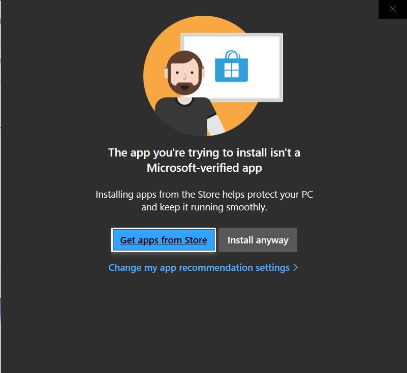
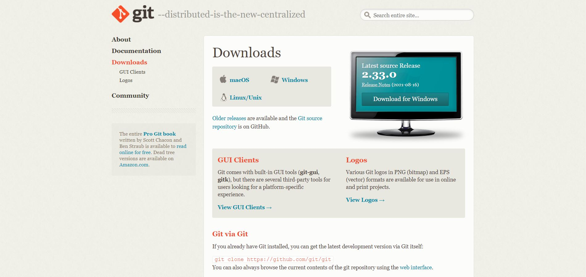
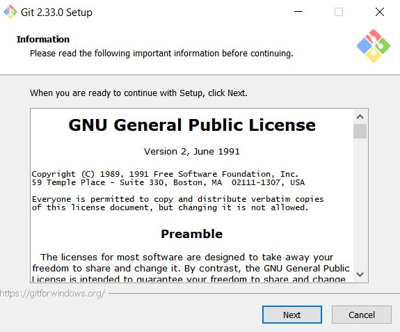
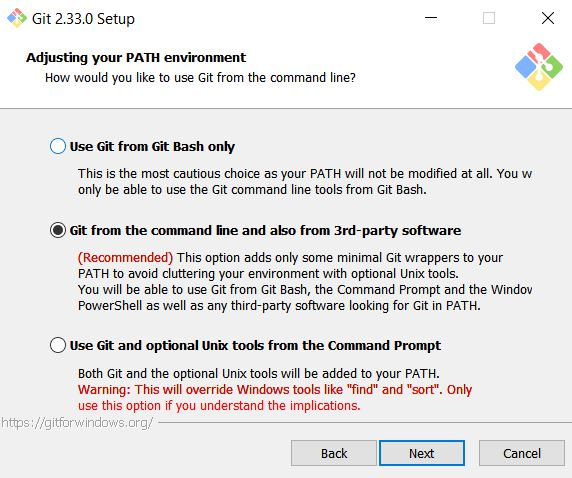
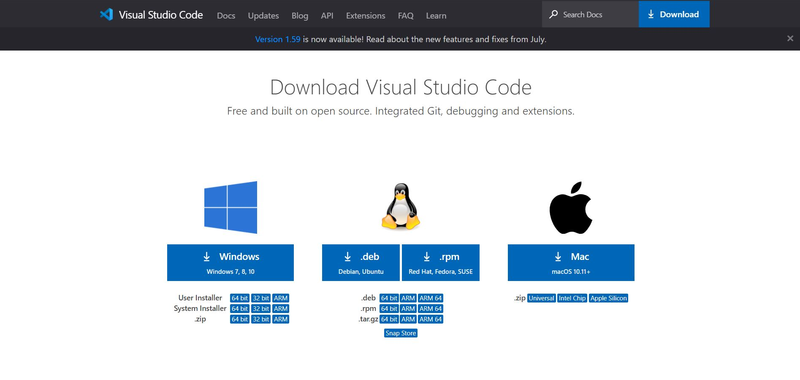
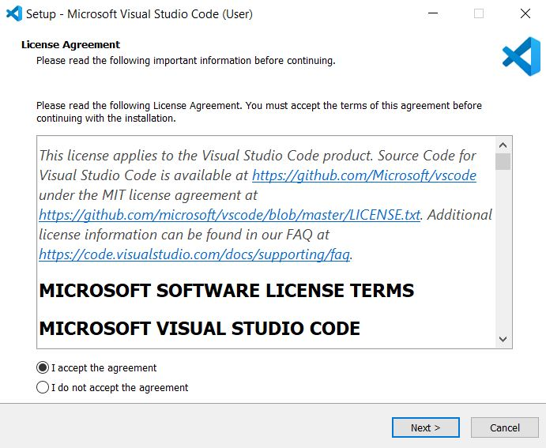
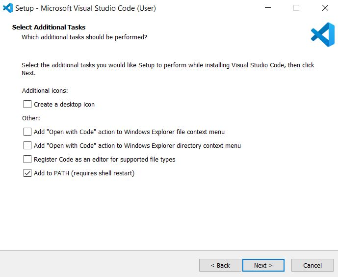

# Machine Setup Tutorial

By: [Mackenzie Scott](https://github.com/kenzerkay)

## Overview
- [Part 1: Install Modern Browser](#part-1-install-mordern-browser)
- [Part 2: Install Git](#part-2-install-git)
- [Part 3: Install Visual Studio Code](#part-3-install-visual-studio-code)
- [Part 4: Create A Github Account](#part-4-create-a-github-account)
- [Part 5: Add Yourself to C4C Github](#part-5-add-yourself-to-c4c-github)
- [Part 6: Let Us Know Your Availability](#part-6-let-us-know-your-availability)

## Part 1: Install Modern Browser 

Here we will walk through how to download [Chrome](https://www.google.com/chrome/){:target="blank" rel="noopener"}, but other modern browsers such as [Firefox](https://www.mozilla.org/en-US/firefox/){:target="blank" rel="noopener"} will work just fine. 

Click on chrome above and you will be taken to this page: 

Click to download chrome and then open the .exe file that downloads on your computer. You may be prompted by this screen below, but select install anyways if so. 

Then you will be prompted with system dialog screens and should select "yes" to any that pop up. After that simply wait for Chrome to install and it should open automatically. 

## Part 2: Install Git

Once you have successfully downloaded a modern browser we will now move on to Git. You can find the link to that page [here](https://git-scm.com/downloads){:target="blank" rel="noopener"} and that will take you to this page. 

From here select the Operating System (OS) of your computer and it should automatically begin to download. You maybe be prompted on yout downloads bar to "keep" or "discard" if so select keep, and similar to before, open the .exe file. You may again be prompted with this screen: 

And if so again click install anyways. You will again be prompted with a system dialog screen and you should again select "yes". 

After that Git will launch and you should see this screen:

You can click next through most of these as the defaults are fine except make sure to choose this option when you reach this screen:

Once you reach the least page the next button will become an install button, and then you are done.

## Part 3: Install Visual Studio Code 

Once we have Chrome and Git we can install our third and final thing which is Visual Studio Code. The link for that can be found [here](https://code.visualstudio.com/download){:target="blank" rel="noopener"}. You should land here:

Where you again should select your correct OS. You will follow the same prompts as before to "keep" if prompted "install anyways". Open the .exe file and this page should pop-up:

Click that you agree to the Liscencing Agreement, and similar to git you can click next through most of the pages except you must make sure that VS Code is added to your path similar to Git. 

Once you have done this get to the last page where you can click "Install", and then wait for it to finish downloading and click "Finish".

## Part 4: Create A Github Account

After everything has been installed on your computer you will need a [GitHub account](https://github.com/join){:target="blank" rel="noopener"} so that we are able to work collaboratively on coding projects.

Once you reach this page click sign-up and follow the prompts to enter your email and set up a username and password (Remember these! They are pretty important). We reccommend also adding your real name and/or profile picture to your account so we are able to better connect you with your account. 

## Part 5: Add yourself to the C4C Github

After all of this is done, fill out the survey on [our homepage](https://code4community.github.io/){:target="blank" rel="noopener"}, and we will add you to the GitHub

## Part 6: Let Us Know Your Availability

Before, moving on to the next tutorial, please let us know your [availability](https://docs.google.com/spreadsheets/d/1sB_6yL7rx1-0chFmpYwMmmUff-o6aS_IIy9-mXVpEt8/edit?usp=sharing){:target="blank" rel="noopener"}, so we are able to schedule our outreach events at times when you guys will be able to participate. 

